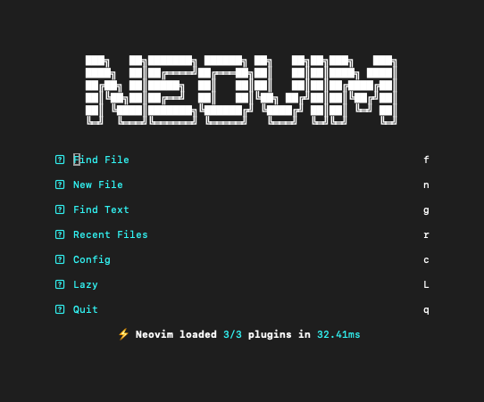

I've recently been working to join the nvim elite and never touch a mouse again. I have found this game ([Vim Genius](http://www.vimgenius.com/)) to really help get you going, after a few hours of these levels, I was already feeling pretty confident using vim. After that I wanted to customize it and make it look and feel like my own personal space, similar to how I have done with hyprland and regolith recently. Below I am going to walk through the set up for both lazy.nvim and snacks.nvim: 

First is to install the most important piece, and that is, of course, neovim:
```bash
# Debian
sudo apt-get install neovim
#Mac OS
brew install neovim
```
From here you can run nvim in terminal to open neovim and begin testing things out.

Next we want to configure lazy.nvim and make sure it is functional. For this we will need to create a few directories and a few short config files.

``` bash
# create the config directory
mkdir -p ~/.config/nvim/lua/config

# create the lazy.lua file and paste in the boostrap/setup code from https://lazy.folke.io/installation
nvim ~/.config/nvim/lua/config/lazy.lua

# next we can create the init.lua file
nvim ~/.config/nvim/init.lua

# add tthe boostrap code for this as well
require("config.lazy")

# here I ran into an error when trying to start nvim: 
# 'Error detected while processing /Users/cam/.config/nvim/init.lua: 
# No specs found for module "plugins" Press ENTER or type command to continue'
#
# if you run into this just do the following:
# create the plugins directory
mkdir -p ~/.config/nvim/lua/plugins

# create a sample plugin spec
nvim ~/.config/nvim/lua/plugins/example.lua

# example.lua that adds a file explorer
return {
  {
    "nvim-tree/nvim-tree.lua",
    dependencies = { "nvim-tree/nvim-web-devicons" },
    config = function()
      require("nvim-tree").setup()
    end
  }
}

# now restart nvim and you should be rocking with lazy.     
```
Once all of that is complete lazy should be working and you can update/sync lazy.

Next we will install snacks.nvim which is the bread and butter of this entire writeup. This gives us a trove of useful plugins for vim that make it a thrill to use.
Edit your lazy.lua with this following:

```bash
# run
nvim ~/.conmfig/nvim/lua/config/lazy.lua

# add the following by replacing this section at the bottom of your lua file
-- Setup lazy.nvim
require("lazy").setup({
  {
    "nvim-treesitter/nvim-treesitter",
    build = ":TSUpdate"
  },
  {
  "folke/snacks.nvim",
  priority = 1000,
  lazy = false,
  ---@type snacks.Config
  opts = {
    -- your configuration comes here
    -- or leave it empty to use the default settings
    -- refer to the configuration section below
    bigfile = { enabled = true },
    dashboard = { enabled = true },
    explorer = { enabled = true },
    indent = { enabled = true },
    input = { enabled = true },
    picker = { enabled = true },
    notifier = { enabled = true },
    quickfile = { enabled = true },
    scope = { enabled = true },
    scroll = { enabled = true },
    statuscolumn = { enabled = true },
    words = { enabled = true },
  },
}
})

# :wq to save and then run nvim!
```

After saving and running nvim, it should install all of the necessary packages for you. You can sync or check again after it's done and then exit out by pressing q. You should now have snacks ready to go and can add any of the plugins you desire!


I will share my personal dotfiles next time!